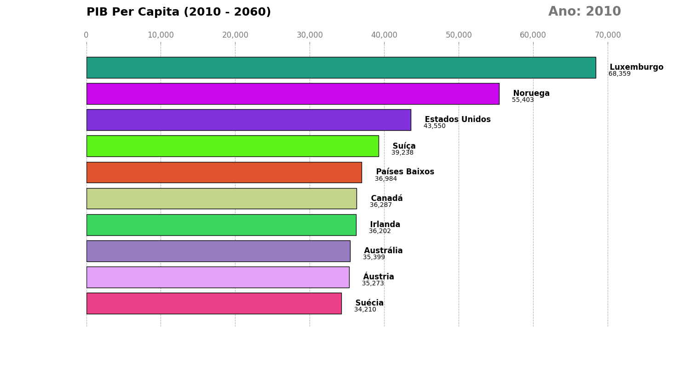

# 📊 Gráfico de Corrida - PIB Per Capita

Uma visualização animada da evolução do PIB per capita dos principais países do mundo entre 2010 e 2060.


## 🎥 Demonstração



## 📖 Sobre o Projeto

Este projeto cria uma animação dinâmica em estilo "bar chart race" (gráfico de corrida com barras) que visualiza a evolução do PIB per capita de diversos países ao longo de 50 anos. A visualização permite acompanhar de forma intuitiva como a posição econômica dos países muda ao longo do tempo.

### Características Principais

- ✨ Animação suave com interpolação de dados entre anos
- 🏆 Exibição dos top 10 países a cada frame
- 🎨 Cores únicas geradas aleatoriamente para cada país
- 🇧🇷 Nomes dos países traduzidos para português
- 📈 Valores formatados com separadores de milhar
- 💾 Exportação em formato GIF de alta qualidade

## 🛠️ Tecnologias Utilizadas

| Biblioteca | Versão Mínima | Finalidade |
|------------|---------------|------------|
| **Python** | 3.11+ | Linguagem base |
| **Pandas** | 2.3+ | Manipulação de dados |
| **NumPy** | 1.18+ | Operações numéricas |
| **Matplotlib** | 3.10+ | Visualização e animação |
| **Pillow** | 7.0+ | Geração do GIF |

## ⚙️ Configurações Personalizáveis

Você pode ajustar diversos parâmetros no código:

```python
# Número de países exibidos simultaneamente
num_of_elements = 10

# Dimensões do gráfico (largura, altura)
figsize=(15, 8)

# Velocidade da animação (milissegundos por frame)
interval=200

# Taxa de frames do GIF gerado
fps=8
```

## 🌍 Países Incluídos

A visualização traduz automaticamente os seguintes países para português:

- 🇧🇷 Brasil
- 🇺🇸 Estados Unidos
- 🇨🇳 China
- 🇮🇳 Índia
- 🇯🇵 Japão
- 🇩🇪 Alemanha
- 🇫🇷 França
- 🇬🇧 Reino Unido
- 🇮🇹 Itália
- 🇪🇸 Espanha
- 🇰🇷 Coreia do Sul
- 🇲🇽 México
- E muitos outros...

## 🎨 Detalhes da Visualização

A animação gerada inclui:

- **Barras horizontais coloridas** - Uma cor única para cada país
- **Rótulos dinâmicos** - Nome do país e valor do PIB exibidos à direita
- **Indicador temporal** - Ano atual destacado no canto superior direito
- **Título descritivo** - "PIB Per Capita (2010 - 2060)"
- **Grid de referência** - Linhas verticais para facilitar a leitura
- **Formatação numérica** - Valores com separadores de milhar

## 🔧 Processamento de Dados

O script realiza as seguintes operações:

1. **Filtragem** - Remove agregados (OECD Total, World, etc.)
2. **Tradução** - Converte nomes dos países para português
3. **Pivotagem** - Reorganiza dados em formato amplo
4. **Interpolação** - Preenche anos faltantes com valores estimados
5. **Normalização** - Converte de volta para formato longo
6. **Ordenação** - Classifica países por PIB a cada ano

## 🤝 Contribuindo

Contribuições são muito bem-vindas! Para contribuir:

1. Faça um fork do projeto
2. Crie uma branch para sua feature (`git checkout -b feature/NovaFuncionalidade`)
3. Commit suas mudanças (`git commit -m 'Adiciona nova funcionalidade'`)
4. Push para a branch (`git push origin feature/NovaFuncionalidade`)
5. Abra um Pull Request

### Ideias de Melhorias

- [ ] Adicionar bandeiras dos países nas barras
- [ ] Permitir seleção de período customizado
- [ ] Exportar também em formato MP4
- [ ] Adicionar opção de tema escuro
- [ ] Criar interface gráfica (GUI)
- [ ] Adicionar mais opções de visualização

## 👨‍💻 Autor

**Aram Bohmann Leite Da Luz**

- [GitHub](https://github.com/seu-usuario)
- [LinkedIn](https://linkedin.com/in/seu-perfil)

## 🙏 Agradecimentos

- Inspiração em visualizações de bar chart race popularizadas pelo Flourish
- Comunidade Python pela excelente documentação

## 📚 Referências

- [Matplotlib Animation Tutorial](https://matplotlib.org/stable/api/animation_api.html)
- [Pandas Documentation](https://pandas.pydata.org/docs/)

---

⭐ **Se este projeto foi útil para você, considere dar uma estrela!**

🐛 **Encontrou um bug?** [Abra uma issue](https://github.com/seu-usuario/Grafico-de-Corrida-PIB-Per-Capita/issues)

💡 **Tem uma sugestão?** [Inicie uma discussão](https://github.com/seu-usuario/Grafico-de-Corrida-PIB-Per-Capita/discussions)
